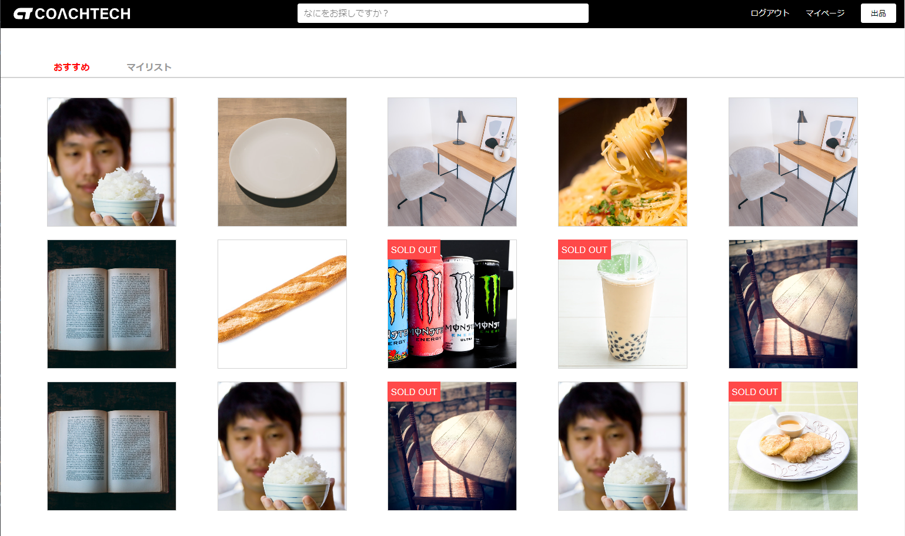

<p align="center"><a href="https://laravel.com" target="_blank"></a></p>

<p align="center">
<a href="https://travis-ci.org/laravel/framework"></a>
<a href="https://packagist.org/packages/laravel/framework"></a>
<a href="https://packagist.org/packages/laravel/framework"></a>
<a href="https://packagist.org/packages/laravel/framework"></a>
</p>

# フリマアプリ
学習用によくあるフリマアプリを開発しました。  
会員登録、ログインすれば出品や購入（仮）、コメント等ができます。  



## 作成した目的
勉強のアウトプットとして作成しました。

## アプリケーションURL
http://18.181.221.66(現在停止中)

## 機能一覧
ログイン機能、メール認証、商品の閲覧、商品検索  
  
【ログイン後】  
お気に入り追加/削除、商品へのコメント、プロフィール変更、出品、購入  
  
【管理者権限】  
ユーザー一覧閲覧、ユーザー削除、ショップとユーザーのやり取り確認、お知らせメール送信  
  
【店舗代表者権限】  
ショップスタッフの招待/削除  
※招待された利用者は商品を出品/コメントができる

## 仕様技術
docker、Laravel 8.x、PHP 7.4、laravel-fortify、laravel-permission、javascript、node.js

## テーブル設計及びER図


## 環境構築
### cmd 上
```bash
$ git clone https://github.com/bokazuya25/FreaMarket.git

# docker起動
$ docker compose up -d --build

# phpコンテナに入る
$ docker compose exec php bash
```
### PHPコンテナ内
```bash
$ composer install
```

### FleaMarket/src 上
```bash
# .env作成
$ cp .env.local .env
```

### PHPコンテナ内
```bash
# アプリケーションキー作成
$ php artisan key:generate

# データベース作成
$ php artisan migrate --seed

# シンボリックリンクの作成
$ php artisan storage:link
```

### FleaMarket/src 上
```bash
# storage ディレクトリの権限変更
$ sudo chmod -R 775 storage

# bootstrap/cache ディレクトリの権限変更
$ sudo chmod -R 775 bootstrap/cache
```

### PHPコンテナ内
CSS を変更する場合
```bash
$ npm install
$ npm run watch
```

### ダミーデータの説明
#### ユーザー一覧
1. 管理者　　　email: admin@admin.com
2. 店舗代表者　email: shop@shop.com　※"shop_id: 1"の代表者
3. ユーザー　　　email: test@test.com  

※パスワードは全て"password"でログインできます。